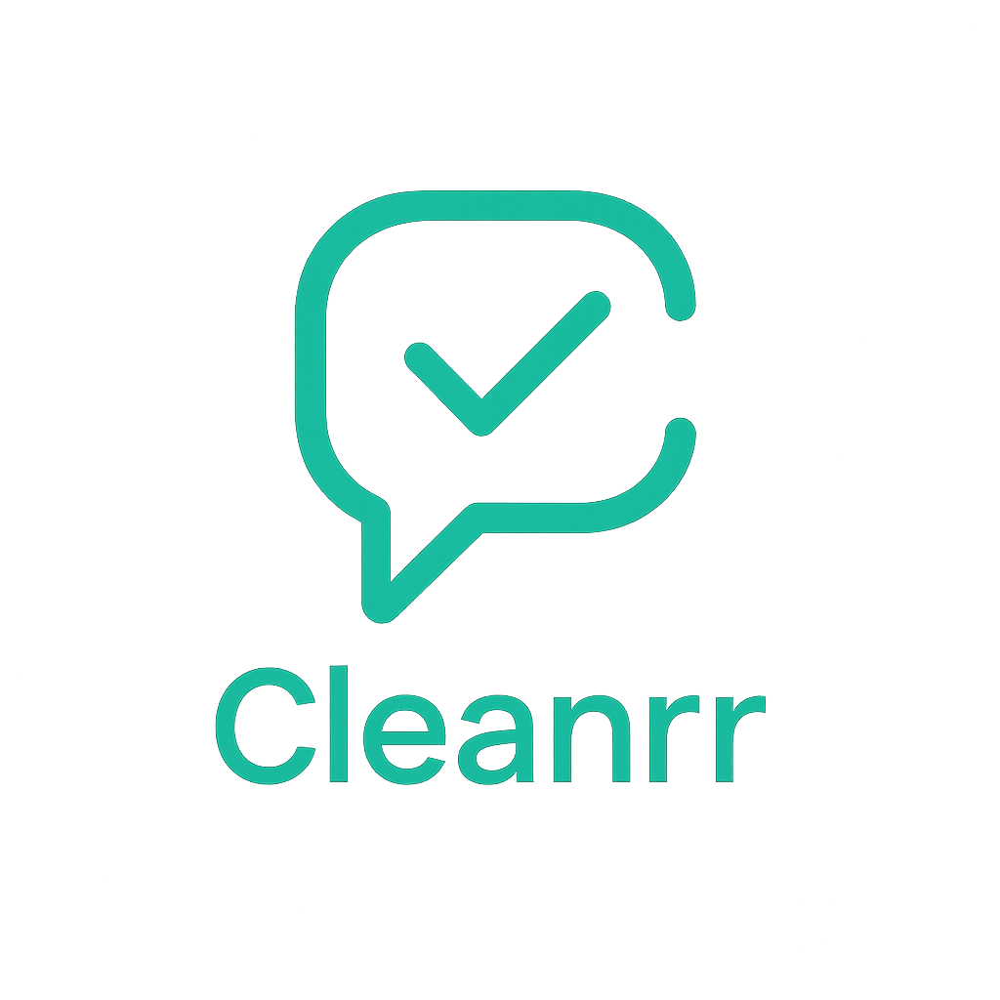

[](https://github.com/zxoir/cleanrr/actions)
[](https://github.com/zxoir/cleanrr/releases)
[](LICENSE)
[](https://github.com/zxoir/cleanrr/stargazers)
[](https://nodejs.org/)
[](#)
[](https://hub.docker.com/r/zxoir/cleanrr)
[](https://hub.docker.com/r/zxoir/cleanrr/tags)

<p align="center">
  <a href="https://github.com/zxoir/cleanrr">
    
  </a>
</p>

# Cleanrr Bot – WhatsApp reminders for Overseerr (Docker-ready)

A lightweight, self‑hosted WhatsApp bot that listens to Overseerr webhooks and, after a delay, asks the requester “Are you done watching?”. Optionally cleans up via Radarr/Sonarr when the user confirms. Built with Node.js + TypeScript and packaged for Docker.

## Key features

- **Webhook‑driven**: reacts to Overseerr events.
- **WhatsApp DM**: sends a reminder and understands “yes/no” replies.
- **Optional cleanup**: on “yes”, delete from Radarr/Sonarr (if configured).
- **Durable scheduling**: BullMQ + Redis; idempotent jobs with backoff.
- **Simple storage**: SQLite (file‑based), no external DB required.
- **Production packaging**: multi‑stage Dockerfile, non‑root runtime, `/health` endpoint.

## Tech stack

- **Runtime**: Node 20, TypeScript (ESM/NodeNext)
- **Web**: Express
- **Bot**: Baileys (WhatsApp)
- **Queue**: BullMQ + Redis
- **Storage**: SQLite
- **HTTP**: Axios
- **Config/Validation**: dotenv + Zod
- **Logging**: Pino (structured logs)

## Requirements

- Docker (recommended for users) or Node.js 20+ (for local dev)
- Redis (single instance is enough)
- Overseerr (and optionally Radarr/Sonarr API endpoints)

## Quick start (Docker)

1. Create `.env` (see **Environment** below).
2. Start Redis (compose or your own).
3. Run the container:

```bash
docker run -d --name cleanrr   -p 3000:3000   --env-file .env   -v $(pwd)/session:/app/session   -v $(pwd)/data:/app/data   ghcr.io/<you>/<repo>:latest
```

> The container runs as a non‑root user and persists the WhatsApp session and SQLite DB under the mounted `session/` and `data/` directories.

## Docker Compose example

```yaml
services:
  app:
    image: docker.io/zxoir/cleanrr:latest
    init: true
    environment:
      OVERSEERR_API_URL: ${OVERSEERR_API_URL}
      OVERSEERR_API_KEY: ${OVERSEERR_API_KEY}
      OVERSEERR_WEBHOOK_SECRET: ${OVERSEERR_WEBHOOK_SECRET-}
      PORT: ${PORT-3000}
      RADARR_API_URL: ${RADARR_API_URL-}
      RADARR_API_KEY: ${RADARR_API_KEY-}
      SONARR_API_URL: ${SONARR_API_URL-}
      SONARR_API_KEY: ${SONARR_API_KEY-}
      REDIS_URL: ${REDIS_URL-redis://redis:6379}
      DB_PATH: /app/data/app.sqlite
      WHATSAPP_SESSION_PATH: /app/session
      MOVIE_DELAY_DAYS: ${MOVIE_DELAY_DAYS-0}
      SHOW_DELAY_DAYS: ${SHOW_DELAY_DAYS-0}
      RETRY_INTERVAL_HOURS: ${RETRY_INTERVAL_HOURS-24}
      LOG_LEVEL: ${LOG_LEVEL-info}
    ports:
      - "3000:3000"
    depends_on:
      - redis
    volumes:
      - ./data:/app/data
      - ./session:/app/session
    healthcheck:
      test:
        [
          "CMD",
          "node",
          "-e",
          "fetch('http://localhost:3000/health').then(r=>process.exit(r.ok?0:1)).catch(()=>process.exit(1))"
        ]
      interval: 30s
      timeout: 5s
      retries: 3
      start_period: 10s

  redis:
    image: redis:7-alpine
    restart: unless-stopped
    command: ["redis-server", "--save", "60", "1", "--loglevel", "warning"]
    volumes:
      - redis-data:/data

volumes:
  redis-data:
```

## Environment

Create `.env` (or pass variables in your orchestrator). Values shown here are examples; adjust to your setup.

| Variable                   | Type   | Required    | Default                | Description                                                                 |
| -------------------------- | ------ | ----------- | ---------------------- | --------------------------------------------------------------------------- |
| `OVERSEERR_API_URL`        | URL    | yes         | –                      | Overseerr API base, e.g. `https://overseerr.local/api/v1`                   |
| `OVERSEERR_API_KEY`        | string | yes         | –                      | Overseerr API key                                                           |
| `OVERSEERR_WEBHOOK_SECRET` | string | recommended | –                      | Shared secret; if set, webhook must include header `x-request-id: <secret>` |
| `RADARR_API_URL`           | URL    | no          | –                      | Radarr API base (optional)                                                  |
| `RADARR_API_KEY`           | string | no          | –                      | Radarr API key (optional)                                                   |
| `SONARR_API_URL`           | URL    | no          | –                      | Sonarr API base (optional)                                                  |
| `SONARR_API_KEY`           | string | no          | –                      | Sonarr API key (optional)                                                   |
| `REDIS_URL`                | URL    | yes         | `redis://redis:6379`   | Redis connection string                                                     |
| `DB_PATH`                  | path   | no          | `/app/data/app.sqlite` | SQLite file path inside container                                           |
| `WHATSAPP_SESSION_PATH`    | path   | no          | `/app/session`         | Baileys session folder (bind‑mount for persistence)                         |
| `MOVIE_DELAY_DAYS`         | number | no          | `0`                    | Days to wait before asking for movies (0 = immediate)                       |
| `SHOW_DELAY_DAYS`          | number | no          | `0`                    | Days to wait before asking for series (0 = immediate)                       |
| `RETRY_INTERVAL_HOURS`     | number | no          | `24`                   | Hours to wait before asking again after a “no”                              |
| `PORT`                     | number | no          | `3000`                 | HTTP port inside container                                                  |
| `LOG_LEVEL`                | enum   | no          | `info`                 | Pino log level: fatal/error/warn/info/debug/trace                           |

## Overseerr webhook setup

1. In Overseerr → **Settings → Notifications → Webhooks**, create a new webhook:
   - **URL**: `http://<YOUR_HOST>:3000/overseerr`
   - **Header (recommended)**: `x-request-id: <OVERSEERR_WEBHOOK_SECRET>` (must match your `.env`)
2. Enable **Request Automatically Approved** and **Request Approved** notifications for the webhook (required).
3. Save.

## Linking WhatsApp & trying it

1. Start the container and view logs; scan the QR when prompted (first run).
2. Send the bot a DM: `!verify <your-overseerr-email>` (this opts you in).
3. Make a request in Overseerr. With delays set to `0`, the bot will message immediately.
4. Reply `yes` to delete via Radarr/Sonarr (if configured), or `no` to be reminded later.
5. Other commands:
   - `!list` — show tracked titles/status
   - `!test` — schedule a 1s test reminder
   - (If implemented) `!delete <title>` — delete a specific title
   - (If implemented) `!stop` / `!delete-me` — opt‑out and/or erase your data

## Health & logs

- **Health check**: `GET /health` returns `{ "status": "ok" }` when the app is ready.
- **Logs**: Pino structured logs (JSON). In development, you can pipe through `pino-pretty` for readability.

## Upgrading

- Pull the latest image or update to a tagged semantic version (e.g., `:1.1.0`).
- The database and session are persisted via volumes; upgrades are safe as long as you keep those mounts in place.
- Breaking changes will be noted in release notes.

## Security & privacy

- Uses an **unofficial WhatsApp library (Baileys)**. Use at your own risk. Your WhatsApp number may be limited/banned if you violate WhatsApp policies. Only message users who **opt in** (they must DM the bot with `!verify <email>`).
- Not affiliated with or endorsed by **Meta/WhatsApp**, **Overseerr**, **Radarr**, or **Sonarr**.
- Minimal data stored: WhatsApp JID ↔ email and request metadata. Avoid sharing your `.env`, logs with PII, or volumes publicly.
- If you need to reset the WA session, stop the container and remove the `session/` volume; you’ll scan a fresh QR next start.

## Development (optional)

```bash
# Node 20+
npm ci
npm run dev          # starts server in watch mode
npm run typecheck
npm run lint
npm run build
```

## License

MIT License — see `LICENSE`.
